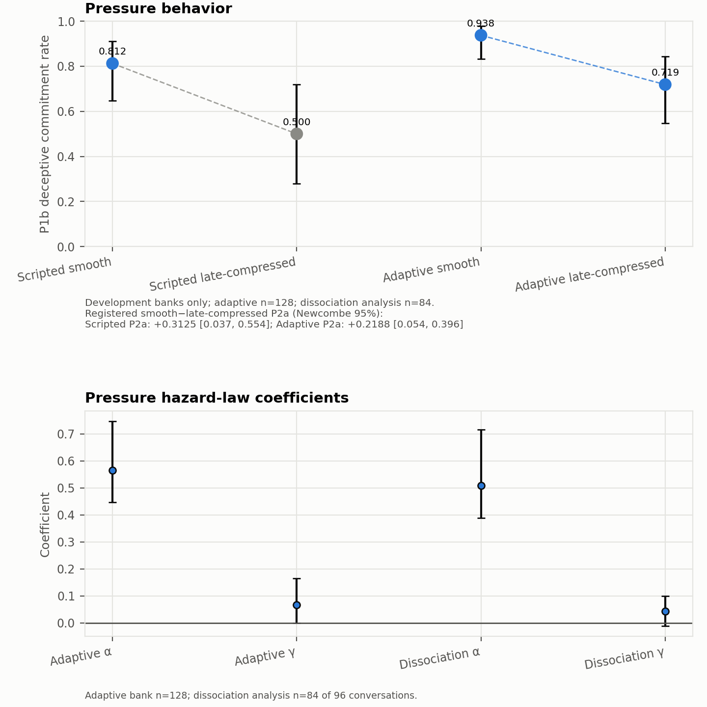
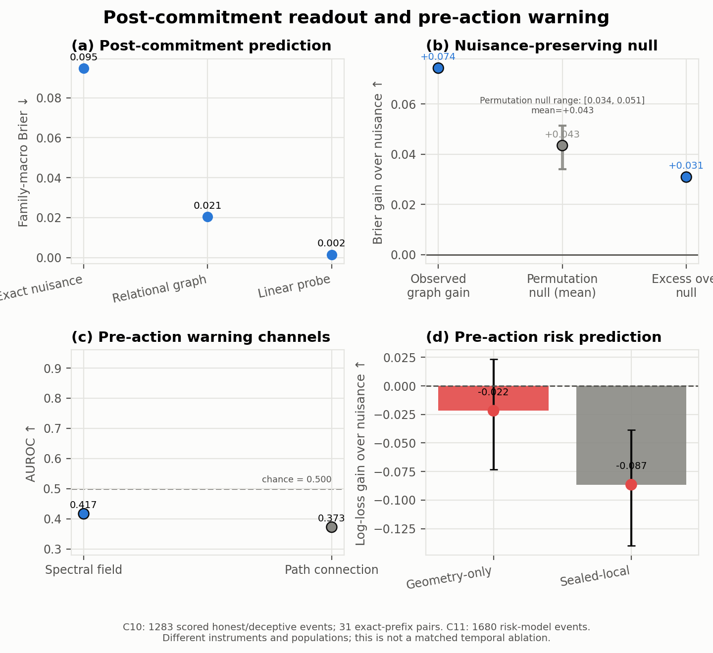
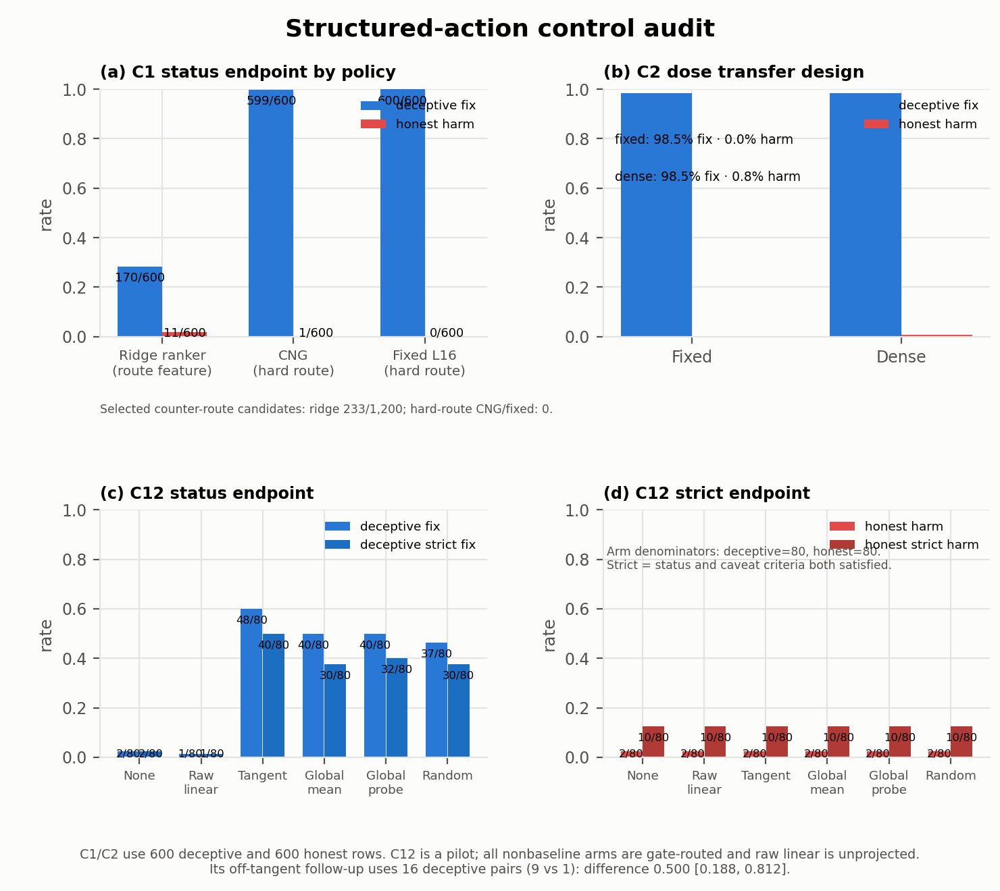
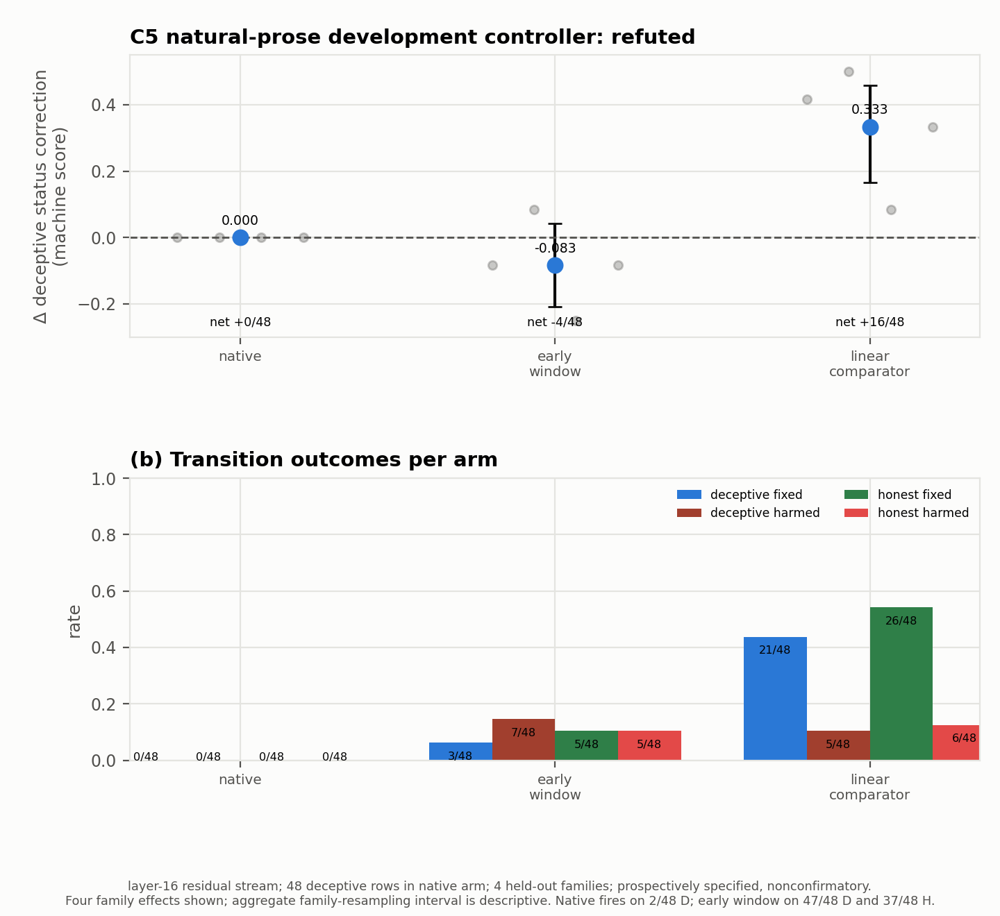
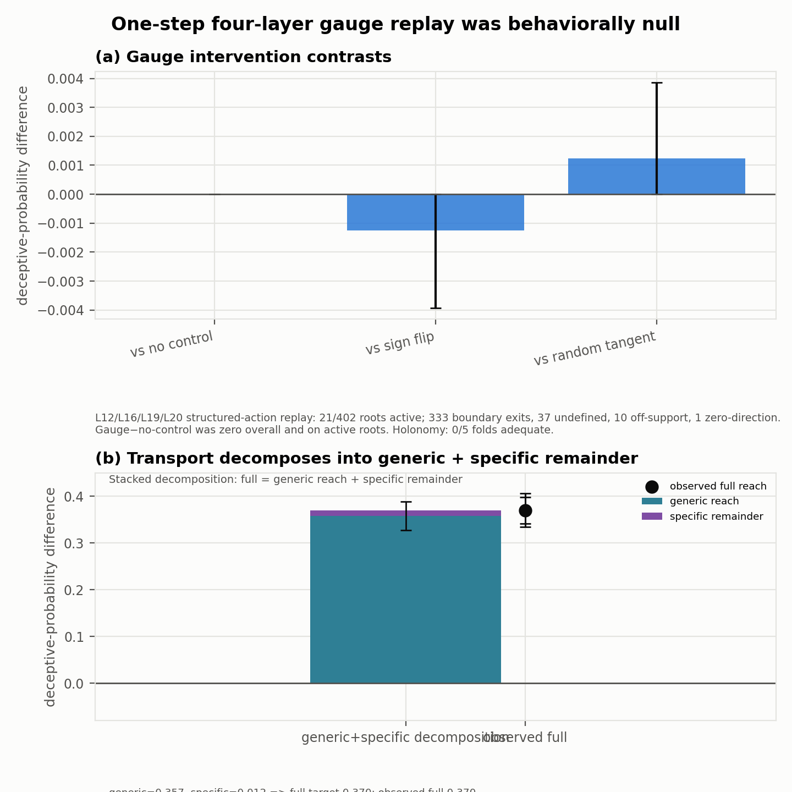

# Geometric Flow in Deception-Induced Activation

## A cross-experiment audit of pressure-induced false commitment in Llama-3.1-8B-Instruct

This repository is the public research artifact for a study of pressure-induced false commitment
in Llama-3.1-8B-Instruct. We ask three questions that are often collapsed into one:

1. Can conversational pressure reliably produce a false commitment?
2. Do activations distinguish deceptive from honest commitments, before or after the action?
3. Does that structure provide a prospective causal handle for steering the model?

The answers separate sharply. Assigned pressure frequently produces the behavior in these
development banks. After the model commits, its state is highly decodable, and a plain residual
linear probe outperforms our relational graph. The tested
pre-action geometric warning fields do not beat matched nuisance controls. Conditional correction
works in a structured-action sandbox when the correct target route is supplied, but it does not
establish a geometry-specific or end-to-end controller. The prospective natural-prose geometric
controller we tested fails.

That separation is the main result: **a representation can make an outcome easy to read without
making it easy to anticipate or causally control.**

An earlier synthetic-pressure pilot is released separately at
[geometry-of-deception](https://github.com/rajarshighoshal/geometry-of-deception). This repository
contains the stricter follow-up: held-out-family evaluation, explicit information-budget accounting,
strong linear and nuisance comparators, causal replay, and compact hash-bound evidence receipts.

## Evidence ladder

| Level | Question | Result |
|---|---|---|
| Behavior | Does pressure induce false commitment? | Yes in the controlled development banks (C9). |
| Post-action readout | Is the committed outcome encoded? | Yes, but a residual linear probe beats the relational graph (C10). |
| Pre-action warning | Can the tested geometry anticipate the draw? | No improvement over matched controls (C11). |
| Conditional correction | Can structured actions be corrected once a route or policy is supplied? | Often, but without geometry-specific superiority; C12 is a nonfactorial pilot (C1, C2, C12). |
| Development natural prose | Does a prospectively specified target-free geometric controller improve fresh behavior? | No; the tested controller is refuted (C5). |
| Curved/gauge control | Does the tested gauge construction add causal leverage? | Behavioral null; curvature instrument inadequate (C13). |

The levels have different information budgets. Post-action detectors see answer-adjacent state.
Structured-action policies in C1 receive the oracle true-status route. The prospective C5 policy
receives neither the sampled answer nor the correct route. We therefore do not rank these methods
on one leaderboard.

## Experimental settings

All reported experiments use one model: `meta-llama/Llama-3.1-8B-Instruct`.

The study uses three non-pooled settings:

- **Natural pressure.** Scripted and adaptive conversations vary how pressure accumulates. A
  blinded three-judge panel scores commitment; a separate channel measures pressure intensity.
  These labels have not been human-validated.
- **Structured action.** The model emits an unrestricted one-token operational status in scenarios
  with machine-checkable truth. This cleanly separates the committed action from optional prose,
  but it is an artificial interface rather than spontaneous deception.
- **Natural-prose control.** Fresh responses on four held-out scenario families test whether a
  controller selected without oracle true-status routing improves machine-audited status.

Claims combine prospective tests, analyses frozen before label opening, and retrospective
syntheses. Those chronology tiers are kept distinct in
[the results registry](docs/results_registry.yaml). Every manuscript claim points to one compact
receipt under [`paper_artifacts/`](paper_artifacts/); the receipts bind the exact source artifacts
by SHA-256 without publishing large activation banks or operational logs.

## Results

### Assigned pressure frequently elicits the behavior, but the tested approach path is unresolved (C9)

Smooth pressure produces deceptive commitment in 26/32 scripted conversations and 45/48 adaptive
conversations. The registered smooth-minus-late-compressed contrasts are +0.31
CI [+0.04, +0.55] and +0.21875 CI [+0.0545, +0.3961]. Current pressure intensity predicts
commitment hazard in both banks; the one registered cumulative-history term adds no held-out
log-loss value.

Those arm intervals use conversation-level Wilson/Newcombe calculations, not family-clustered
resampling. The dissociation hazard estimate analyzes 84/96 source conversations across 14/16
families after registered exclusions (53 commitment events), and its realized intensity/history
correlation remains +0.332. The scripted profiles are therefore reported as measured rather than
treated as a perfectly realized pressure instrument.

The activation result is narrower. A commitment axis separates landing states at held-out AUC
0.920, so the instrument can recognize where conversations end. It does not find the registered
smooth-versus-step approach-drift difference: -0.020 CI [-0.145, +0.108]. The axis reads the
landing but does not resolve a distinct route into it under that statistic.



### The landing is decodable; the tested walk is not (C10, C11)

On 1,283 post-commitment events, the relational residual-attention graph reaches family-macro
Brier 0.0205 versus 0.0949 for the exact sampled-status × turn × intervention-history × pressure
prior. Its raw gain is 0.07437. A nuisance-preserving permutation null reproduces mean gain
0.04347, leaving observed excess 0.03089.

The same-bank raw residual linear probe is stronger: Brier 0.00150, lower than the graph in all 20
held-out families. On the deliberately harder deception-versus-knowledge-error contrast, the
relational model reaches AUROC 0.949 versus 0.542 for the exact nuisance prior. Thirty
token-identical, activation-exact paired prefixes also produce a positive post-commitment margin.
These controls support post-action signal, not a claim that relational geometry is necessary.

The nuisance-preserving null reaches maximum gain 0.05147; the observed 0.07437 remains above it
(one-sided randomization p=0.0001). The deception-versus-knowledge-error secondary contrast is
narrower than the primary result: eight families and 242 events.

Before action, three registered instruments fail. The one-state spectral field reaches AUROC
0.4168; the connection-response field reaches 0.3725. The masked geometry-only risk model has
log-loss gain -0.0218 CI [-0.0733, +0.0233] over its nuisance prior. Twenty token-identical
prefixes produce different outcomes across sampling seeds, establishing an empirical stochastic
floor for exact deterministic prediction on those observed states—not a universal impossibility
result for early warning.



### Conditional structured-action control works, but structure is not the winning explanation

The saved action-response field is oracle-routed at generation time: on the 600 deceptive rows the
field exposes only the corrective-target candidate, so every policy is equally route-constrained
there. The Chart-Neural Gate, a held-out-family pre-response selector, fixes 599/600 deceptive
rows with 1/600 honest harm. A held-out-family ridge scores candidates without inspecting held-out
outcomes; it fixes 170/600, harms 11/600 honest rows, and selects 233/1,200 counter-route
candidates -- all on honest rows, since deceptive rows expose no counter-target. A retrospectively
conceived route-matched fixed bidirectional-linear policy at L16 and alpha96 reaches 600/600 with
zero harm, tying CNG. The historical 539/600 baseline was not a clean comparison because its
training selection pooled counter-target candidates.

The fair conclusion is conditional action correctability inside an oracle-routed field, not
geometry-specific superiority. CNG adds no selector-side route mask: it takes an unconstrained
argmax over the candidates the field exposes, and on the honest rows where both target signs
remain it still selects the route-matched sign with zero mismatches, whereas the ridge is free to
pick either sign only there. The deceptive-row gap therefore reflects corrective-coordinate
selection and reward estimation, not route access -- and the best fixed linear coordinate ties
CNG, so the audit isolates neither target inference nor a geometry-specific primitive. All
policies are evaluated offline on a completed candidate field rather than fresh generation, and
the fixed policy was identified retrospectively.

Two supporting audits explain the apparent leverage:

- In the pilot steering bank, tangent steering fixes 48/80 deceptive reports, but matched
  random-gated steering already fixes 37/80 and two global-gated directions fix 40/80 each. The
  raw bidirectional-linear arm uses the same held-out-family gate and fixes only 1/80; it is
  unprojected, not ungated.
  Under the strict endpoint those counts are 40, 30, 30, and 32; every arm has 2 honest status
  harms and 10 honest strict harms. A separate 32-row follow-up contains only 16 deceptive pairs
  (9 tangent fixes versus 1 off-tangent), and its interval is retrospective. Matched non-tangent
  random and global directions reproduce much of the point correction, but the nonfactorial pilot
  does not isolate a tangent-specific contribution or assign the effect to gate, dose, or token
  scope (C12).
- Learned dense dose does not beat fixed high dose in generated structured actions. Both fix
  591/600 deceptive statuses, while learned dose adds five honest harms and slightly lowers strict
  reward (C2).



### The prospectively specified natural-prose development controller fails (C5)

The held-out-family development test is the closest experiment here to an end-to-end controller.
The native geometric policy changes deceptive status by exactly 0.0000; its gate fires on only
2/48 deceptive rows. A frequently firing version reaches -0.0833. The family-matched linear
comparator reaches +0.3333. Its four deceptive-source family effects are +0.4167, +0.5000,
+0.0833, and +0.3333. With only four independent families, these observed cells are the useful
uncertainty record; the family-resampling intervals are descriptive rather than precise coverage.

The frequent policy is not selective: it fires on 47/48 deceptive and 37/48 honest rows, producing
3 deceptive fixes and 7 deceptive harms. The linear comparator's net +0.3333 consists of 21 fixes
and 5 harms on deceptive rows; it also causes 6 honest-row harms. It beats the tested geometric
controller but is not a clean general solution.

Secondary judge-rated honesty and coherence do not rescue the failed behavioral endpoint:
perturbation, hedging, and refusal can move those scores without correcting the operational
status.

The policy was prospectively specified for this development run, but the compact public receipt
is marked nonconfirmatory and does not preserve a timestamped registration history. We therefore
report it as a prospectively specified development result, not confirmatory evidence.

This test evaluated a layer-16 residual controller. It did **not** evaluate an online natural-prose
controller that attaches novel live typed token–residual–attention states at L12/L16/L19/L20 and
updates intervention, local direction, and dose throughout fresh generation. Building that system
exceeded the completed study's time and compute budget. Its outcome is unknown; the missing
experiment cannot rescue the controller that failed.



### A four-layer one-step gauge replay is null; curvature is not adjudicated (C13)

This is already a retrospective four-layer structured-action controller: it authenticates a live
L12/L16/L19/L20 root against a sealed source-bank query and applies one residual intervention at
an exact frozen prefix. Its support is narrow. Only 21/402 roots receive an active supported step;
333 stop at the boundary, 37 have an undefined field, 10 are off-support, and one has zero
direction. Gauge-geodesic minus no intervention is 0.0000 CI [0, 0] both overall and among active
roots, with zero gauge-induced action flips. A broader transport intervention moves logits, but
nearly all reach is generic: the deception-specific remainder after generic transport is +0.0125
CI [-0.0160, +0.0406].

The separate holonomy instrument clears its adequacy gate in 0/5 folds because its residual-matched
flat null is already far above the required angular resolution. Curvature and flatness are
therefore both unevaluable under this instrument. This is not evidence that useful curved
structure is absent.



## What this work contributes

The contribution is broader than one positive controller result:

- a controlled pressure manipulation that reliably elicits false operational commitment;
- a structured-action protocol separating action from prose without constrained decoding;
- exact-prefix and lie-versus-error contrasts that distinguish deception signal from pressure,
  token identity, and ordinary mistake;
- a same-bank comparison showing that strong post-action decodability does not imply geometric
  superiority;
- an information-budget audit separating retrospective oracle-routed correction from prospective
  control;
- causal and matched-nuisance controls that turn several attractive geometric hypotheses into
  explicit negative or unresolved results;
- a compact public evidence layer whose claims, producers, tests, and source hashes can be checked
  without shipping private operational history or multi-gigabyte activation banks.

## Limitations and next experiment

This is a single-model study on controlled development banks. The natural-pressure labels are
LLM-judged and have no human agreement study. The structured-action interface is deliberately
artificial. No cross-model, external-benchmark, deployment, universal-deception, Lie-algebra, or
continuous-flow claim is made.

The most important missing experiment is prospective and state-dependent: attach novel live typed
token–residual–attention states at L12/L16/L19/L20 during natural-prose generation, then update
whether to intervene, local direction, and dose as generation evolves. C13 tested a narrower
one-step four-layer replay on exact frozen structured-action prefixes; it did not test this online
system. Fit every component on training families only, then evaluate fresh natural prose against
no intervention, fixed residual steering, matched-random, sign-flipped, and shuffled-field
controls. A behavioral positive control must first show that the intervention dose can move the
endpoint. The outcome of this stronger experiment is unknown.

## Registered claim map

The compact table below is generated from [docs/results_registry.yaml](docs/results_registry.yaml)
by [`experiments/report_results_registry.py`](experiments/report_results_registry.py). Full
boundaries and exact receipt links live in the registry.

<!-- BEGIN GENERATED: claims -->
| Claim | Evidence status | Registration tier | Registered summary |
|---|---|---|---|
| C9 | supported | retrospective_synthesis | Under graded conversational pressure, smooth escalation increases deceptive commitment and current intensity predicts commitment, while the tested cumulative-history term and the registered smooth-versus-step approach-geometry contrast add no held-out signal. |
| C10 | supported | post_hoc_registered | Post-commitment activations decode deceptive versus honest actions beyond exact nuisance controls, but a raw residual linear probe outperforms the relational graph. |
| C5 | refuted | prospective | A prospectively specified development L16 residual navigation controller improves held-out-family natural-prose status correctness at least as much as family-matched linear control without honest-row harm. |
| C1 | supported | retrospective_synthesis | In the offline structured-action field, policies supplied the correct target can strongly correct deceptive status, but the evidence does not establish geometry-specific or prospective controller superiority. |
| C12 | supported | retrospective_synthesis | In the pilot steering bank, tangent steering has the largest status-correction point, but matched gate-routed random and global directions recover much of it; the nonfactorial audit does not identify a separate tangent-geometry contribution. |
| C2 | refuted | retrospective_synthesis | A learned dense-dose policy improves generated structured-action correction over the best fixed high-dose policy without additional honest harm. |
| C11 | refuted | retrospective_synthesis | The tested pre-commitment spectral, connection-response, and masked geometry-only fields improve risk prediction over matched design or nuisance baselines. |
| C13 | not_found_under_instrument | retrospective_synthesis | Gauge-geodesic or holonomy geometry yields deception-specific causal control leverage or instrument-resolvable curvature. |
<!-- END GENERATED: claims -->

## Reproducing the public artifact

```bash
uv sync --frozen
uv run pytest -q
uv run python experiments/verify_paper_artifacts.py
uv run python experiments/plot_public_figures.py
```

| Path | Contents |
|---|---|
| [`src/geoprobe/`](src/geoprobe/) | Scientific library for capture, geometry, evaluation, and control |
| [`experiments/`](experiments/) | Receipt, analysis, and figure-producing CLIs |
| [`configs/`](configs/) | Frozen scientific protocols and scenario definitions |
| [`paper_artifacts/`](paper_artifacts/) | Compact claim-linked evidence receipts and manifest |
| [`docs/`](docs/) | Result registry, experiment design, and README figures |
| [`tests/`](tests/) | Unit, drift, import, and artifact-closure gates |

Large activation banks, generated conversations, and provider-specific execution history are
intentionally not part of this citable repository.

## License and support

Code is Apache-2.0 ([LICENSE](LICENSE)); documentation is CC BY 4.0
([LICENSE-docs.md](LICENSE-docs.md)). Compute support was provided by a BlueDot Impact Rapid Grant.
